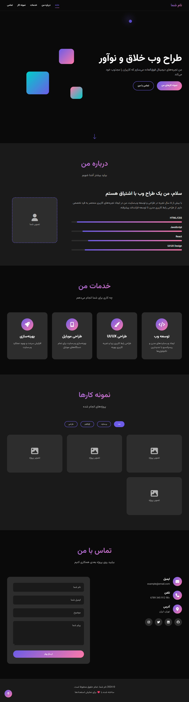

# 🎨 Portfolio Template - قالب پورتفولیو

یک قالب پورتفولیو مدرن و کاملاً ریسپانسیو برای طراحان وب، توسعه‌دهندگان و افراد خلاق.

## ✨ ویژگی‌ها

- 🎯 **طراحی مدرن**: استفاده از جدیدترین تکنیک‌های طراحی UI/UX
- 📱 **کاملاً ریسپانسیو**: بهینه برای تمام دستگاه‌ها (دسکتاپ، تبلت، موبایل)
- 🌟 **انیمیشن‌های روان**: انیمیشن‌های زیبا و تعاملی
- 🎨 **کرسور سفارشی**: تجربه کاربری منحصر به فرد
- 🔥 **افکت‌های بصری**: گرادیانت‌های زیبا و عناصر شناور
- 📧 **فرم تماس**: فرم کاربردی با اعتبارسنجی
- 🎯 **فیلتر پورتفولیو**: نمایش پروژه‌ها بر اساس دسته‌بندی
- ⚡ **بهینه‌سازی شده**: کد تمیز و بهینه برای سرعت بالا
- 🌍 **پشتیبانی RTL**: بهینه برای زبان فارسی

## ✨ تصویر نمونه



## 🎯 نمونه سایت

[مشاهده Demo زنده](https://jahanweb-co.github.io/portfolio-template)

## 🚀 شروع سریع

### 1. دانلود و راه‌اندازی

```bash
# کلون کردن مخزن
git clone https://github.com/jahanweb-co/portfolio-template.git

# ورود به پوشه پروژه
cd portfolio-template

# باز کردن در مرورگر
open index.html
```

### 2. ساختار فایل‌ها

```
portfolio-template/
│
├── index.html             # فایل اصلی HTML
├── style.css              # استایل‌های CSS
│   script.js              # کدهای JavaScript
├── images/                # پوشه تصاویر (شما باید ایجاد کنید)
│   ├── profile.jpg        # تصویر پروفایل
│   ├── project1.jpg       # تصاویر پروژه‌ها
│   └── ...
├── README.md              # مستندات پروژه
└── LICENSE                # مجوز استفاده

```

## 🛠️ سفارشی‌سازی

### تغییر اطلاعات شخصی

فایل `index.html` را باز کرده و موارد زیر را ویرایش کنید:

```html
<!-- تغییر نام و عنوان -->
<h1 class="hero-title">
    <span class="text-gradient">طراح وب</span>
    <br>خلاق و نوآور
</h1>

<!-- تغییر اطلاعات تماس -->
<div class="contact-details">
    <h4>ایمیل</h4>
    <p>your-email@example.com</p>
</div>
```

### تغییر رنگ‌ها

فایل `style.css` را باز کرده و متغیرهای رنگ را ویرایش کنید:

```css
:root {
    --primary-color: #6c5ce7;      /* رنگ اصلی */
    --secondary-color: #fd79a8;    /* رنگ ثانویه */  
    --accent-color: #00cec9;       /* رنگ تاکیدی */
    --bg-primary: #0a0a0a;         /* پس‌زمینه اصلی */
    --bg-secondary: #1a1a1a;       /* پس‌زمینه ثانویه */
    --text-primary: #ffffff;       /* متن اصلی */
    --text-secondary: #b3b3b3;     /* متن ثانویه */
}
```

### افزودن تصاویر

1. پوشه `images` ایجاد کنید
2. تصاویر خود را در این پوشه قرار دهید
3. در فایل HTML، placeholder ها را با تصاویر واقعی جایگزین کنید:

```html
<!-- جایگزینی placeholder تصویر پروفایل -->
<div class="about-image">
    
</div>

<!-- جایگزینی placeholder تصاویر پروژه -->
<div class="portfolio-image">
    
</div>
```

### افزودن پروژه جدید

برای افزودن پروژه جدید در بخش portfolio:

```html
<div class="portfolio-item" data-category="web">
    <div class="portfolio-image">
        
        <div class="portfolio-overlay">
            <h3>نام پروژه</h3>
            <p>توضیح کوتاه پروژه</p>
            <div class="portfolio-links">
                <a href="#" class="portfolio-link" title="مشاهده"><i class="fas fa-eye"></i></a>
                <a href="#" class="portfolio-link" title="لینک پروژه"><i class="fas fa-external-link-alt"></i></a>
            </div>
        </div>
    </div>
</div>
```

### تغییر مهارت‌ها

مهارت‌ها را در بخش about ویرایش کنید:

```html
<div class="skill-item">
    <span class="skill-name">نام مهارت</span>
    <div class="skill-bar">
        <div class="skill-progress" data-width="90%"></div>
    </div>
</div>
```

## 🎨 انیمیشن‌ها و افکت‌ها

### انیمیشن‌های موجود:
- ✨ Loading screen با انیمیشن
- 🎯 Smooth scroll بین بخش‌ها  
- 💫 Parallax effect برای عناصر شناور
- 🎨 Hover effects روی کارت‌ها
- 📊 انیمیشن skill bars
- 🖱️ Custom cursor با trail effect
- 🔄 Fade in animations برای بخش‌ها

### غیرفعال کردن انیمیشن‌ها

برای غیرفعال کردن انیمیشن‌ها، این کد را به CSS اضافه کنید:

```css
@media (prefers-reduced-motion: reduce) {
    *, *::before, *::after {
        animation-duration: 0.01ms !important;
        animation-iteration-count: 1 !important;
        transition-duration: 0.01ms !important;
    }
}
```

## 📱 ریسپانسیو طراحی

قالب برای breakpoint های زیر بهینه شده:

- 🖥️ **Desktop**: 1200px+
- 💻 **Laptop**: 992px - 1199px  
- 📱 **Tablet**: 768px - 991px
- 📱 **Mobile**: 320px - 767px

## 🔧 بهینه‌سازی عملکرد

### تکنیک‌های استفاده شده:
- ⚡ Lazy loading برای تصاویر
- 🎯 Throttled scroll events
- 💾 Efficient DOM manipulation
- 🔄 CSS transforms به جای position changes
- 📦 Minified و optimized کد

### بهبود سرعت:
```html
<!-- Preload critical resources -->
<link rel="preload" href="style.css" as="style">
<link rel="preload" href="script.js" as="script">

<!-- Optimize images -->

```

## 🌐 سئو (SEO)

### Meta tags مهم:
```html
<meta name="description" content="توضیح درباره شما و کارتان">
<meta name="keywords" content="طراحی وب، UI/UX، فرانت‌اند">
<meta name="author" content="نام شما">

<!-- Open Graph -->
<meta property="og:title" content="نام شما - طراح وب">
<meta property="og:description" content="توضیح درباره شما">
<meta property="og:image" content="images/og-image.jpg">
<meta property="og:url" content="https://yourwebsite.com">

<!-- Twitter Card -->
<meta name="twitter:card" content="summary_large_image">
<meta name="twitter:title" content="نام شما - طراح وب">
<meta name="twitter:description" content="توضیح درباره شما">
<meta name="twitter:image" content="images/twitter-image.jpg">
```

## 📧 راه‌اندازی فرم تماس

### گزینه 1: استفاده از Formspree
```html
<form action="https://formspree.io/f/YOUR_FORM_ID" method="POST">
    <!-- فیلدهای فرم -->
</form>
```

### گزینه 2: استفاده از Netlify Forms
```html
<form name="contact" method="POST" data-netlify="true">
    <!-- فیلدهای فرم -->
</form>
```

### گزینه 3: Backend سفارشی
فایل `script.js` را ویرایش کرده و endpoint API خود را اضافه کنید.

## 🚀 Deploy کردن

### GitHub Pages:
1. پروژه را در GitHub آپلود کنید
2. به Settings → Pages بروید  
3. Source را "Deploy from a branch" انتخاب کنید
4. Branch را "main" و folder را "/ (root)" انتخاب کنید

### Netlify:
1. پروژه را در GitHub آپلود کنید
2. در Netlify "New site from Git" را انتخاب کنید
3. مخزن GitHub خود را متصل کنید
4. Deploy settings پیش‌فرض را تایید کنید

### Vercel:
```bash
npm i -g vercel
vercel --prod
```

## 🔧 ابزارهای توسعه

### VS Code Extensions پیشنهادی:
- Live Server
- Prettier
- Auto Rename Tag
- CSS Peek
- HTML Snippets

### ابزارهای آنلاین:
- [CSS Gradient Generator](https://cssgradient.io/)
- [Google Fonts](https://fonts.google.com/)
- [Font Awesome Icons](https://fontawesome.com/)
- [Unsplash Images](https://unsplash.com/)

## 🐛 رفع مشکلات

### مشکلات رایج:

**انیمیشن‌ها کار نمی‌کنند:**
- بررسی کنید JavaScript لود شده باشد
- Console browser را چک کنید

**رنگ‌ها درست نمایش داده نمی‌شوند:**
- CSS variables را بررسی کنید
- مرورگر cache را پاک کنید

**فرم تماس کار نمی‌کند:**
- Action فرم را تنظیم کنید
- Server-side handling اضافه کنید

## 📋 To-Do List

برای بهبود قالب:

- [ ] اضافه کردن blog section
- [ ] پشتیبانی از چند زبان
- [ ] اضافه کردن dark/light mode toggle
- [ ] بهبود accessibility
- [ ] اضافه کردن PWA features
- [ ] Integration با CMS

## 🤝 مشارکت

برای مشارکت در بهبود این قالب:

1. Fork کنید
2. Branch جدید ایجاد کنید (`git checkout -b feature/AmazingFeature`)
3. تغییرات را commit کنید (`git commit -m 'Add some AmazingFeature'`) 
4. Push کنید (`git push origin feature/AmazingFeature`)
5. Pull Request ایجاد کنید

## 📄 مجوز

این پروژه تحت مجوز MIT منتشر شده - [LICENSE](LICENSE) را برای جزئیات بیشتر مطالعه کنید.

## 🙏 تشکر

- [Font Awesome](https://fontawesome.com/) برای آیکون‌ها
- [Google Fonts](https://fonts.google.com/) برای فونت Vazirmatn
- [Unsplash](https://unsplash.com/) برای تصاویر نمونه

## 📞 پشتیبانی

اگر سوال یا مشکلی دارید:

- ⭐ بهترین راه: Issue جدید در GitHub ایجاد کنید

---

**ساخته شده با ❤️ برای جامعه توسعه‌دهندگان ایران**

> نکته: این قالب به صورت کاملاً رایگان در اختیار شما قرار می‌گیرد. اگر مفید بود، ⭐ یادتون نره!

## 📊 آمار پروژه


 

